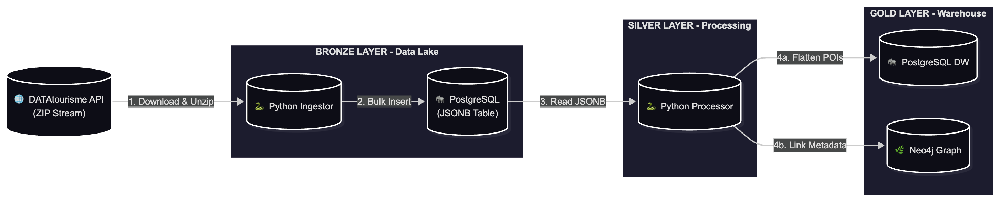

# 🌍 Holiday Itinerary Data Platform
**Project:** feb26_bde_int_holiday


**Version:** 1.0.0

### The objective of the project is to create an application that proposes an itinerary according to certain criteria. The user of the application chooses areas / points of interest to visit during his next trip, as well as the duration of the stay and the app proposes a detailed itinerary optimizing his travel and stay time.
---

## 🏗️ System Architecture


## 📂 Project Structure
* **data/raw:** Objects, Context, and Index JSON files.
* **docker-compose.yml:** Orchestrates PostgreSQL and Neo4j.
* **src/ingestion:** Python scripts to load JSON into Postgres.
* **src/transformation:** Logic to extract POIs and map relationships.

## 🚀 Getting Started
1. Run `docker-compose up -d` to start databases.
2. Run `python src/extract_api.py` to ingest files.

Project Organization 
------------
```my_data_project/
├── .env                  # 🔒 Private: API tokens & DB passwords (GIT IGNORED)
├── .gitignore            #  Shield: Prevents .env and /data/ from going to GitHub
├── config.yaml           #  Control Panel: API URLs, table names, batch sizes
├── docker-compose.yml    #  Infrastructure: Spins up Postgres, Neo4j, & Python
├── Dockerfile            #  Recipe: Instructions to build your Python environment
├── requirements.txt      #  Ingredients: List of libraries (requests, PyYAML, etc.)
├── references/           # 📚 DOCUMENTATION
│   ├── .gitkeep          # Keeps empty folder in Git
│   └── architecture.mmd  # Mermaid diagram source (Edit this)
├── reports/              # 📊 OUTPUTS & FIGURES
│   └── figures/
│       ├── .gitkeep
│       └── architecture.png # The exported image of your pipeline
├── data/                 # 💾 STORAGE: Where actual files live (GIT IGNORED)
│   ├── raw/              #   - Bronze: Original JSONs from DATAtourisme
│   └── processed/        #   - Silver/Gold: Cleaned CSVs or Parquet files
│
└── src/                  
    └── ingestion/         #   - Folder for "Extracting" data
        └── extract_api.py #  - The script that calls the API & saves to /data
```

