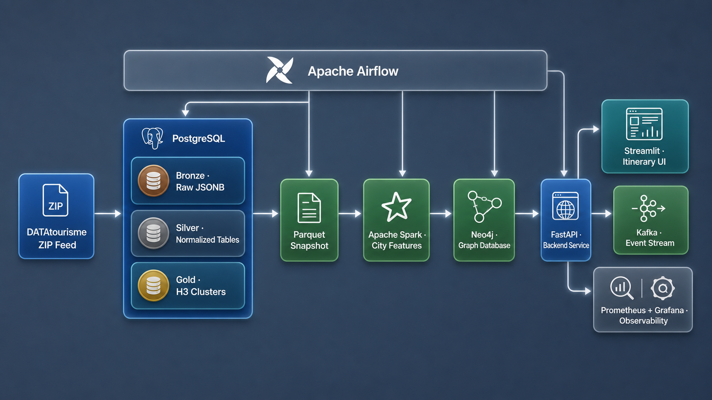

# Holiday Itinerary Data Platform

An end-to-end tourism data platform that ingests DATAtourisme records, builds trusted relational and graph models, generates multi-day itineraries, and exposes operational and product-quality metrics.

**[Open the live portfolio](https://holiday-itinerary-platform.onrender.com/)** · **[Read the project guide](docs/PROJECT_GUIDE.md)**



## Platform

```text
DATAtourisme → Airflow → Bronze JSONB → Silver tables + Parquet
              → Spark + dbt + H3 Gold + Neo4j
              → FastAPI + Streamlit + Kafka
              → Prometheus + Grafana + Alertmanager
```

| Area | Technology |
|---|---|
| Orchestration | Airflow |
| Storage and modeling | Postgres, Parquet, H3, Neo4j, Snowflake |
| Processing | Pandas, Spark, dbt |
| Product delivery | FastAPI, Streamlit |
| Events and operations | Kafka, Prometheus, Grafana, Alertmanager |
| Infrastructure | Docker Compose, Terraform, Kubernetes |

## Quick start

```bash
docker compose up --build airflow-init
docker compose up --build -d
```

Open:

- Streamlit: `http://localhost:8501`
- FastAPI: `http://localhost:8000/docs`
- Airflow: `http://localhost:8088`
- Kafka UI: `http://localhost:8090`
- Spark: `http://localhost:8080`
- Grafana: `http://localhost:3000`
- Prometheus: `http://localhost:9090`
- Adminer: `http://localhost:5050`

## Key implementation

- Pipeline entry point: [`src/pipeline.py`](src/pipeline.py)
- Airflow DAG: [`airflow/dags/holiday_pipeline_dag.py`](airflow/dags/holiday_pipeline_dag.py)
- API: [`src/api/app.py`](src/api/app.py)
- Streamlit: [`src/api/dashboard.py`](src/api/dashboard.py)
- dbt models: [`dbt/models`](dbt/models)
- Monitoring: [`monitoring`](monitoring)

The public Render deployment runs the interactive Streamlit portfolio with a clearly labelled curated sample. The complete backend stack is reproducible through Docker Compose, with recorded dashboard evidence available inside the public portfolio and under [`artifacts/screenshots`](artifacts/screenshots).
