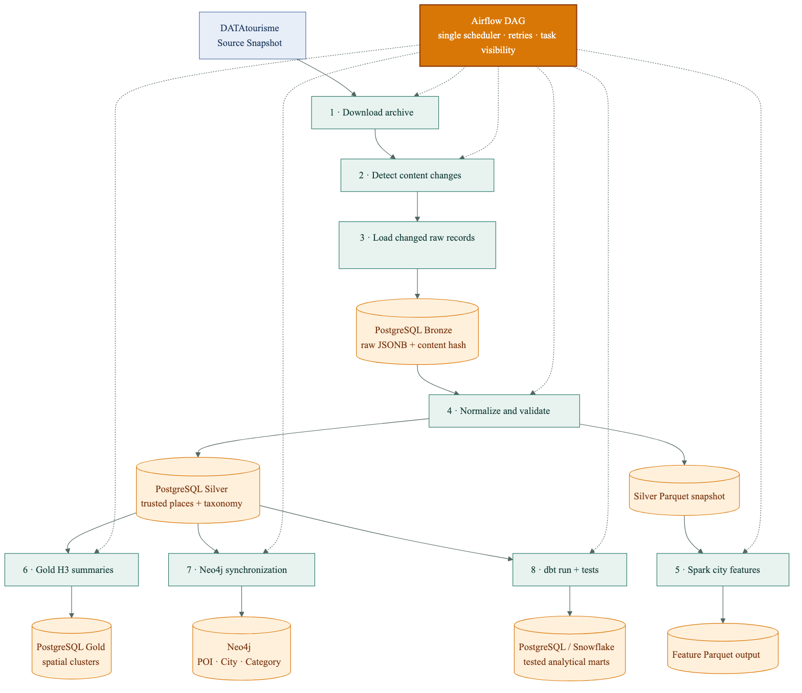

# Holiday Itinerary Tourism Data Platform

An end-to-end tourism data product that turns DATAtourisme snapshots into trusted Points of Interest, explainable multi-day itineraries, analytical features, graph relationships, product events, and operational evidence.

**[Open the live application](https://holiday.hassansalamb.dev/)** · **[Architecture](docs/ARCHITECTURE.md)** · **[Roadmap](docs/ROADMAP.md)**



## What the project demonstrates

- **Data ingestion** — archive retrieval, metadata checks, SHA-256 content comparison, and changed-record loading.
- **Governed data layers** — replayable Bronze JSONB, normalized Silver entities, Parquet snapshots, H3 Gold summaries, and tested dbt marts.
- **Itinerary planning** — Destination and Interest eligibility followed by geographic Day Plan grouping and place-level responses.
- **Graph enrichment** — Neo4j Related Places based on shared tourism categories within the selected Destination.
- **Product events** — Kafka weather and itinerary events persisted by an idempotent analytics consumer.
- **DataOps** — Airflow orchestration, Spark feature computation, Docker packaging, CI, Proxmox release configuration, backups, and health checks.
- **Observability** — Prometheus metrics, Grafana dashboards, and Alertmanager rules for both reliability and product-quality signals.

## Evidence and availability

| Label | Meaning |
|---|---|
| `PORTFOLIO SAMPLE` | The public Render experience uses four curated Paris records so the product remains accessible without the private platform. |
| `RECORDED EVIDENCE` | Screenshots were captured from verified local full-stack executions; they are not presented as currently live interfaces. |
| `LIVE BACKEND` | Optional Proxmox links appear only when the environment is deliberately marked live and a URL is configured. |

The public sample demonstrates interface behavior, not full destination coverage. The full platform consumes DATAtourisme records when a valid feed token and the private data infrastructure are available.

The canonical vocabulary is defined in [CONTEXT.md](CONTEXT.md).

## Architecture

```text
DATAtourisme Source Snapshot
          ↓
Airflow: download → change detection → Bronze → Silver
          ↓                         ↓
     Spark features        PostgreSQL trusted places
                                  ├→ H3 Gold summaries
                                  ├→ Neo4j POI graph
                                  └→ dbt tested marts

Traveller → Streamlit → FastAPI → Interest eligibility → KMeans Day Plans
                                      ├→ Neo4j Related Places
                                      ├→ Open-Meteo context
                                      ├→ Kafka product events
                                      └→ Prometheus / Grafana
```

Four architecture views are available:

1. [System context](docs/ARCHITECTURE.md#level-0--system-context)
2. [Incremental data pipeline](docs/ARCHITECTURE.md#level-1--incremental-data-pipeline)
3. [Itinerary request lifecycle](docs/ARCHITECTURE.md#level-2--itinerary-request)
4. [Render and Proxmox deployment](docs/ARCHITECTURE.md#level-3--deployment-topology)

Editable Mermaid sources and PNG/SVG renders live in [`docs/architecture`](docs/architecture).

## How itinerary planning works

The planner is deterministic and explainable; it is not a trained recommendation model.

1. FastAPI loads Trusted Places for the selected Destination.
2. Selected Interests determine which Candidate Places remain eligible.
3. KMeans groups eligible coordinates into up to the requested number of Day Plans.
4. Places nearest each geographic day centre are selected and ordered consistently.
5. Neo4j adds Related Places sharing tourism categories in the same Destination.
6. Open-Meteo contributes current weather context and a suitability metric.
7. Kafka receives the generated-itinerary event without making broker availability part of the response contract.

Current limitations:

- Fixed demonstration time slots do not use opening hours.
- KMeans improves geographic grouping but does not optimize road/transit travel time.
- Interest selection is eligibility filtering, not learned personalization.
- Weather is measured after planning and does not currently reorder stops.
- Related Places express shared categories, not user-specific relevance.

## Technology choices

| Concern | Technology | Reason |
|---|---|---|
| Orchestration | Airflow | One visible scheduler for ordered tasks, retries, and logs |
| Source and trusted data | PostgreSQL | JSONB replay plus relational quality and analytical queries on one-machine deployments |
| Large snapshot processing | Pandas and Parquet | Precise nested JSON normalization and portable trusted snapshots |
| Feature computation | Spark | Scalable city-feature path over Silver Parquet data |
| Analytical contracts | dbt | Tested, documented SQL marts for PostgreSQL and optional Snowflake |
| Spatial summaries | H3 | Stable geographic aggregation for destination analysis |
| Relationship enrichment | Neo4j | Explicit POI, City, and Category traversal |
| Product interface | FastAPI and Streamlit | Typed request interface and rapid interactive product delivery |
| Product events | Kafka | Decoupled itinerary/weather events with replayable consumption |
| Operations | Prometheus, Grafana, Alertmanager | Health, latency, usage, and quality evidence |

Durable trade-offs are recorded in [`docs/adr`](docs/adr).

## Repository map

```text
.
├── airflow/dags/                 Airflow DAG
├── artifacts/screenshots/       Recorded full-stack execution evidence
├── dbt/                         Sources, staging models, marts, and tests
├── distribution/                Proxmox release Compose and monitoring config
├── docs/
│   ├── adr/                      Architecture Decision Records
│   ├── architecture/             Editable diagrams plus PNG/SVG renders
│   ├── operations/               Proxmox and Kubernetes guidance
│   ├── ARCHITECTURE.md            Technical architecture walkthrough
│   └── ROADMAP.md                 Prioritized product/platform improvements
├── monitoring/                   Prometheus, Grafana, and Alertmanager config
├── scripts/proxmox/              Deployment, health, and backup automation
├── src/
│   ├── api/                      FastAPI, Streamlit, demo data, service registry
│   ├── bronze/                   Archive retrieval and changed-record loading
│   ├── silver/                   Normalization and quality rules
│   ├── gold/                     H3 summaries and Neo4j synchronization
│   ├── spark/                    City feature computation
│   └── streaming/                Kafka publisher and analytics consumer
├── terraform/examples/snowflake/ Optional Snowflake infrastructure example
├── tests/                         Repository and deployment contract tests
├── docker-compose.yml             Full local development platform
└── render.yaml                    Public Streamlit Portfolio Sample
```

The root README is the project entry point. The additional READMEs under `distribution/` and `terraform/` describe those operator-specific interfaces.

## Public Portfolio Sample

Install the lightweight requirements:

```bash
python3.12 -m venv .venv
source .venv/bin/activate
python -m pip install -r requirements-portfolio.txt
```

Run the same mode used by Render:

```bash
PORTFOLIO_DEMO_MODE=true \
BACKEND_ENVIRONMENT_STATUS=recorded \
streamlit run src/api/dashboard.py
```

Open `http://localhost:8501`.

## Full local platform

Prerequisites:

- Docker Engine or Docker Desktop with Compose v2
- A DATAtourisme token/feed identifier for real ingestion
- At least 10–12 GB of memory available to Docker for the complete stack

Configure and initialize:

```bash
cp .env.example .env
# Replace DATATOURISME_TOKEN and any credentials you do not want to keep as local defaults.
docker compose up --build airflow-init
docker compose up --build -d
docker compose ps
```

The API, dashboard, and Kafka analytics consumer now share `APP_IMAGE`. Airflow webserver, scheduler, initialization, and dbt share `AIRFLOW_IMAGE`, preventing local modules from referring to unrelated historical image names.

### Local interfaces

| Interface | URL | Purpose |
|---|---|---|
| Streamlit | `http://localhost:8501` | Itinerary product and engineering evidence |
| FastAPI docs | `http://localhost:8000/docs` | Request interface |
| Airflow | `http://localhost:8088` | Pipeline runs, tasks, retries, and logs |
| Kafka UI | `http://localhost:8090` | Topics and consumer inspection |
| Spark | `http://localhost:8080` | Cluster and job inspection |
| Neo4j Browser | `http://localhost:7474` | POI graph inspection |
| Adminer | `http://localhost:5050` | PostgreSQL inspection |
| Prometheus | `http://localhost:9090` | Metrics and targets |
| Grafana | `http://localhost:3000` | Operational and product dashboards |
| Alertmanager | `http://localhost:9093` | Alert state |

Trigger the DAG `holiday_itinerary_pipeline` from Airflow. Its implemented order is:

```text
bronze_download_zip
  → bronze_detect_and_load_changes
  → silver_normalize
  → spark_city_features
  → gold_postgres
  → neo4j_graph
  → dbt_run_and_test
```

Stop without deleting persistent state:

```bash
docker compose down
```

Use `docker compose down --volumes` only when database and broker data should be deleted intentionally.

## FastAPI interface

| Endpoint | Method | Responsibility |
|---|---|---|
| `/health` | GET | Service and database readiness |
| `/metrics` | GET | Prometheus metrics |
| `/summary` | GET | Dataset and Gold summary |
| `/cities` | GET | Available Destinations |
| `/categories` | GET | Tourism Interests/taxonomy |
| `/places` | GET | Filterable Trusted Places |
| `/weather/current` | GET | Current Open-Meteo context |
| `/generate-itinerary` | POST | Explainable multi-day planning and event publication |

## Tests and validation

Repository tests intentionally validate behavior that can run without external accounts:

```bash
python -m unittest discover -s tests -p 'test_*.py' -v
python -m compileall src airflow/dags
docker compose --env-file .env.example config
```

CI also validates the hardened release Compose file, builds both application images, and publishes immutable GHCR tags on pushes. The pipeline does not claim a live Proxmox deployment.

## Deployment model

- **Render:** public Streamlit Portfolio Sample using `requirements-portfolio.txt`.
- **Proxmox:** intended full platform using immutable images, loopback-bound administrative interfaces, Cloudflare Tunnel, health checks, and backup scripts.
- **Kubernetes:** documented future option for genuinely independent scaling; not required for this one-machine portfolio deployment.
- **Snowflake:** optional dbt/Terraform target; not required by the local PostgreSQL product.

See the [Proxmox runbook](docs/operations/PROXMOX_DEPLOYMENT.md), [release distribution](distribution/README.md), and [Kubernetes guidance](docs/operations/KUBERNETES.md).

## Documentation

- [Architecture](docs/ARCHITECTURE.md)
- [Roadmap](docs/ROADMAP.md)
- [Proxmox deployment](docs/operations/PROXMOX_DEPLOYMENT.md)
- [Kubernetes guidance](docs/operations/KUBERNETES.md)
- [Release distribution](distribution/README.md)
- [Snowflake Terraform example](terraform/README.md)

## Branch workflow

- `dev` is the integration branch for active development.
- Changes are tested on `dev` before being merged into `main`.
- `main` is the release branch and must remain deployable.
- Only `main` and `dev` are maintained as long-lived branches.

## License and attribution

The repository retains its MIT license and original DataScientest attribution. DATAtourisme, Open-Meteo, map tiles, and linked place information remain subject to their respective terms and attribution requirements.
