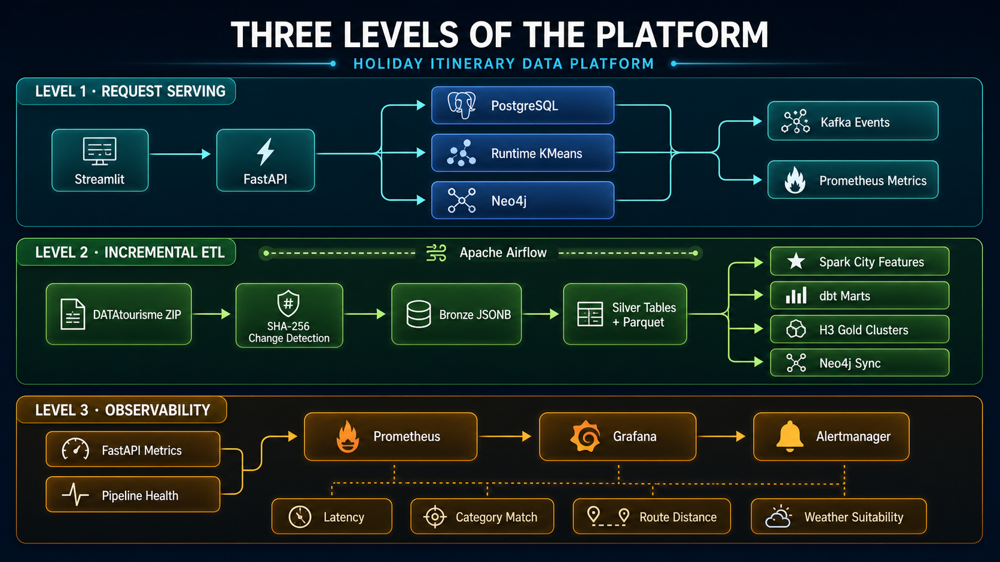
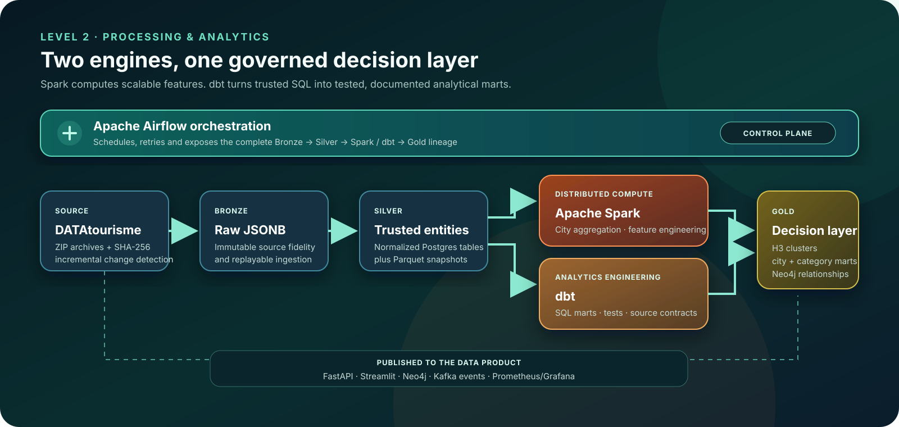

# Holiday Itinerary Data Platform

A tourism intelligence project that turns DATAtourisme records into trusted location data, recommendation APIs, multi-day itineraries, and operational insights.

**[Open the portfolio](https://holiday-itinerary-platform.onrender.com/)** · **[Project guide](docs/PROJECT_GUIDE.md)** · **[Deployment runbook](docs/PROXMOX_DEPLOYMENT.md)**



## How it works

```text
DATAtourisme → Airflow → Bronze / Silver / Gold → Spark + dbt + Neo4j
              → FastAPI + Streamlit → Kafka → Prometheus + Grafana
```

- Airflow orchestrates ingestion, quality checks, transformations, and publishing.
- PostgreSQL, Parquet, H3, and Neo4j support analytical and geographic use cases.
- FastAPI and Streamlit turn the data into an itinerary product.
- Kafka, Prometheus, Grafana, and Alertmanager expose runtime behavior.

### Spark and dbt in the processing layer



Spark performs distributed feature engineering over trusted Silver snapshots. dbt builds tested, documented SQL marts. Both publish decision-ready Gold assets for the API, graph, and product layers.

## Current availability

The Render portfolio is live and uses a curated sample. Backend panels show recorded evidence until a private Proxmox environment is provisioned; they automatically expose live links when service URLs are configured.

## Run locally

```bash
cp .env.example .env
docker compose up --build airflow-init
docker compose up --build -d
```

Start with Streamlit at `http://localhost:8501` and FastAPI at `http://localhost:8000/docs`.

## Explore the implementation

- [Pipeline](src/pipeline.py)
- [Airflow DAG](airflow/dags/holiday_pipeline_dag.py)
- [FastAPI](src/api/app.py)
- [Streamlit portfolio](src/api/dashboard.py)
- [dbt models](dbt/models)
- [Recorded dashboard evidence](artifacts/screenshots)
- [Future Proxmox deployment](docs/PROXMOX_DEPLOYMENT.md)
