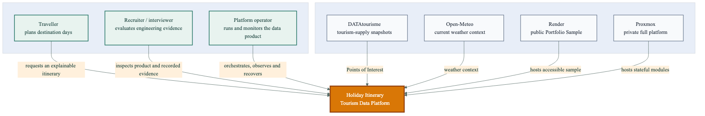
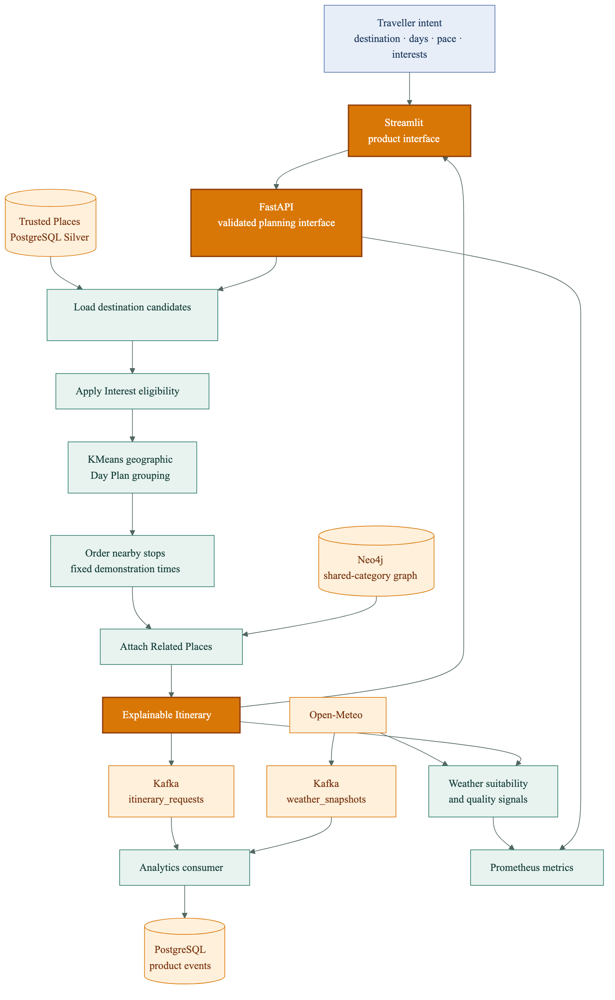
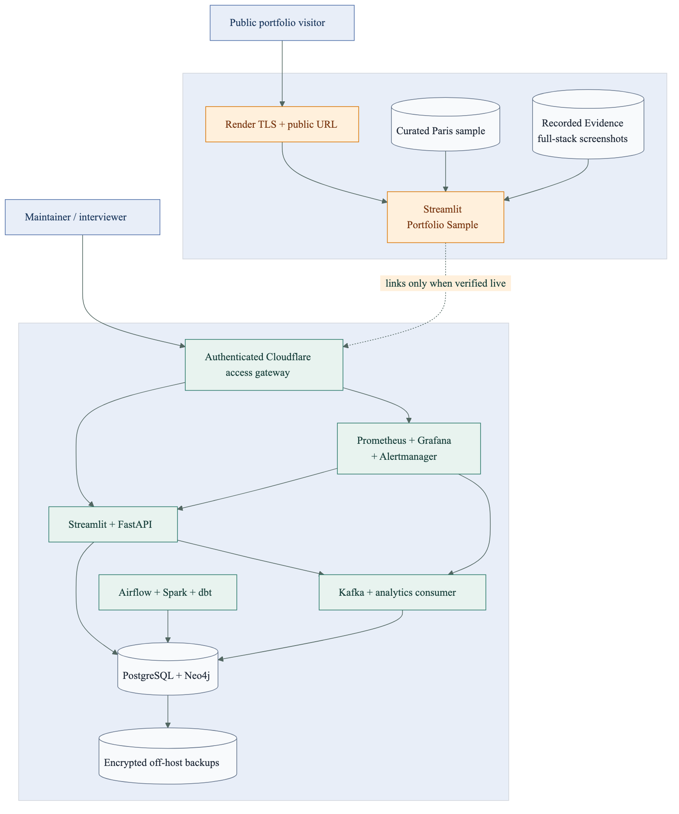

# Architecture

These views narrow from product context to data processing, request-time planning, and deployment. Each PNG and SVG is generated from an adjacent Mermaid source.

## Level 0 — system context

The product serves travellers, demonstrates engineering evidence to reviewers, and gives operators a reproducible platform built from public tourism and weather sources.

[Editable source](architecture/01-system-context.mmd)

## Level 1 — incremental data pipeline

Airflow owns one ordered execution path. Content hashes prevent unchanged source records from forcing unnecessary downstream work, while Bronze, Silver, and Gold have separate trust responsibilities.

[Editable source](architecture/02-data-pipeline.mmd)

## Level 2 — itinerary request

The request path starts from Trusted Places, applies Interest eligibility before geographic grouping, enriches selected stops through Neo4j, and emits product-quality signals without making Kafka availability part of the user response contract.

[Editable source](architecture/03-itinerary-request.mmd)

The fixed two-hour stop windows are demonstration scheduling, not opening-hours or travel-time optimization. Weather currently measures suitability; it does not automatically reorder the plan.

## Level 3 — deployment topology

Render hosts the accessible Portfolio Sample. The full stateful platform belongs on the private Proxmox target and exposes administrative interfaces only through authenticated access.

[Editable source](architecture/04-deployment-topology.mmd)

## Data and evidence contracts

| Evidence | Source | Supports | Does not prove |
|---|---|---|---|
| Portfolio Sample | Curated Paris records | Public interaction and interface behavior | Full DATAtourisme destination coverage |
| Recorded Evidence | Verified local full-stack screenshots | Airflow, Kafka, Spark, database and observability execution | A currently reachable backend |
| Trusted Places | Normalized DATAtourisme records | Place-level filtering, maps and itinerary candidates | Current opening hours or guaranteed availability |
| Open-Meteo response | Current public weather endpoint | Context and suitability metrics | A complete trip-period weather forecast |
| KMeans Day Plans | Geographic grouping over eligible candidates | Compact daily areas | Optimal routing or travel-time minimization |
| Neo4j Related Places | Shared categories within a Destination | Explainable relationship enrichment | Personal relevance or learned similarity |

## Architectural decisions

- [PostgreSQL medallion source of truth](adr/0001-postgres-medallion-source-of-truth.md)
- [Airflow owns the ordered pipeline](adr/0002-airflow-owns-the-ordered-pipeline.md)
- [Plan from Trusted Places and enrich through the graph](adr/0003-plan-from-trusted-places-enrich-with-graph.md)
- [Public sample and private platform](adr/0004-public-sample-private-platform.md)
